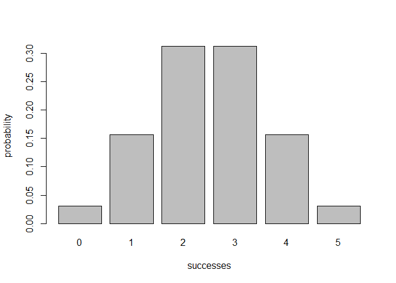
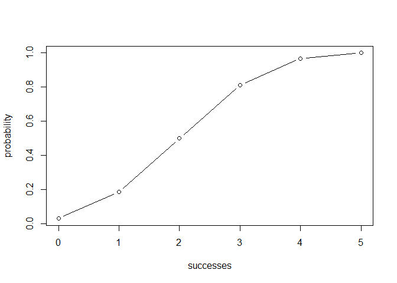

<!-- README.md is generated from README.Rmd. Please edit that file -->
Overview
--------

`"binomial"` is a package that provides functions for binomial calculations

-   `bin_variable()` creates a binomial variable object (of class `"coin"`)
-   `bin_choose()` simulates a choose problem and calculates the number of different outcomes.
-   `bin_probability()` calculates the probability of a binomial distribution.
-   `bin_distribution()` calculates the probability of a binomial distribution and displays them in a list.
-   `bin_cumulative()` calculates the probability of a cumulative binomial distribution and displays them in a list.
-   `bin_mean()` computes the expected mean of a binomial distribution.
-   `bin_variance()` computes the expected variance of a binomial distribution.
-   `bin_mode()` computes the expected mode of a binomial distribution.
-   `bin_skewness()` computes the expected skewness of a binomial distribution.
-   `bin_kurtosis()` computes the expected kurtosis of a binomial distribution.
-   `print()` method for a `"binvar"` object.
-   `print()` method for a `"bindis"` object.
-   `print()` method for a `"bincum"` object.
-   `print()` method for a `"summary.binvar"` object.
-   `summary()` method for a `"binvar"` object.
-   `plot()` method for a `"bindis"` object.
-   `plot()` method for a `"bincum"` object.

Motivation
----------

This package has been developed to illustrate some of the concepts behind the creation of an R package.

Usage
-----

``` r
library(binomial)
mybinvar <- bin_variable(trials = 10, prob = 0.5)
mybinvar
#> [1] "Binomial variable"
#> [1] ""
#> [1] "Parameters"
#> [1] "- number of trials: 10"
#> [1] "- prob of success : 0.5"

mybinvar <- bin_variable(trials = 10, prob = 0.5)
summary_binvar <- summary(mybinvar)
summary_binvar
#> [1] "Summary Binomial"
#> [1] ""
#> [1] "Parameters"
#> [1] "- number of trials: 10"
#> [1] "- prob of success : 0.5"
#> [1] ""
#> [1] "Measures"
#> [1] "- mean    : 5"
#> [1] "- variance: 2.5"
#> [1] "- mode    : 5"
#> [1] "- skewness: 0"
#> [1] "- kurtosis: -0.2"

bin_choose(n = 5, k = 3)
#> [1] 10

bin_distribution(trials = 10, prob = 0.5)
#>    success  probability
#> 1        0 0.0009765625
#> 2        1 0.0097656250
#> 3        2 0.0439453125
#> 4        3 0.1171875000
#> 5        4 0.2050781250
#> 6        5 0.2460937500
#> 7        6 0.2050781250
#> 8        7 0.1171875000
#> 9        8 0.0439453125
#> 10       9 0.0097656250
#> 11      10 0.0009765625

bin_cumulative(trials = 10, prob = 0.5)
#>    success  probability   cumulative
#> 1        0 0.0009765625 0.0009765625
#> 2        1 0.0097656250 0.0107421875
#> 3        2 0.0439453125 0.0546875000
#> 4        3 0.1171875000 0.1718750000
#> 5        4 0.2050781250 0.3769531250
#> 6        5 0.2460937500 0.6230468750
#> 7        6 0.2050781250 0.8281250000
#> 8        7 0.1171875000 0.9453125000
#> 9        8 0.0439453125 0.9892578125
#> 10       9 0.0097656250 0.9990234375
#> 11      10 0.0009765625 1.0000000000

bin_dis <- bin_distribution(trials = 5, prob = 0.5)
plot(bin_dis)
```



``` r

bin_cum <- bin_cumulative(trials = 5, prob = 0.5)
plot(bin_cum)
```



``` r

bin_mean(trials = 10, prob = 0.5)
#> [1] 5

bin_skewness(trials = 10, prob = 0.5)
#> [1] 0
```
